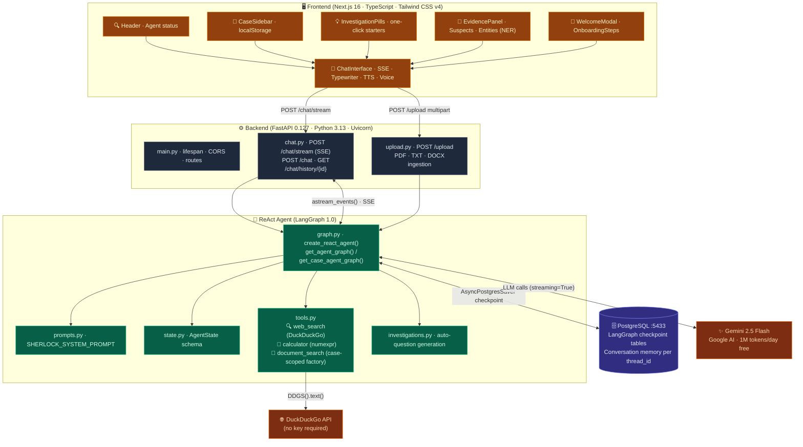
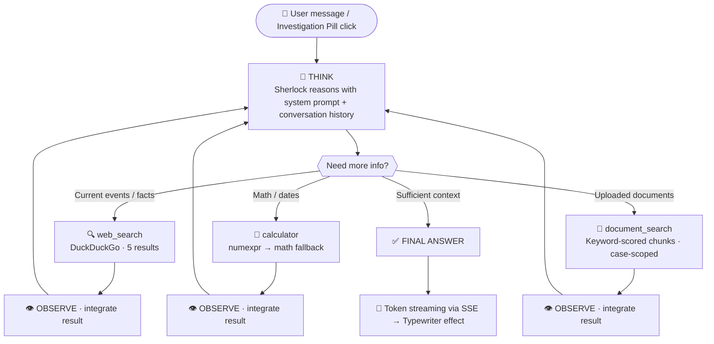
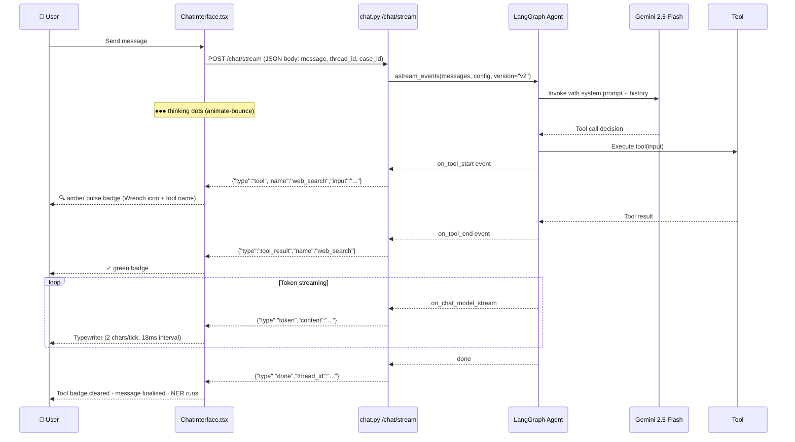
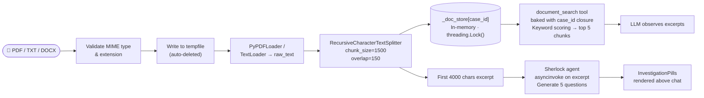
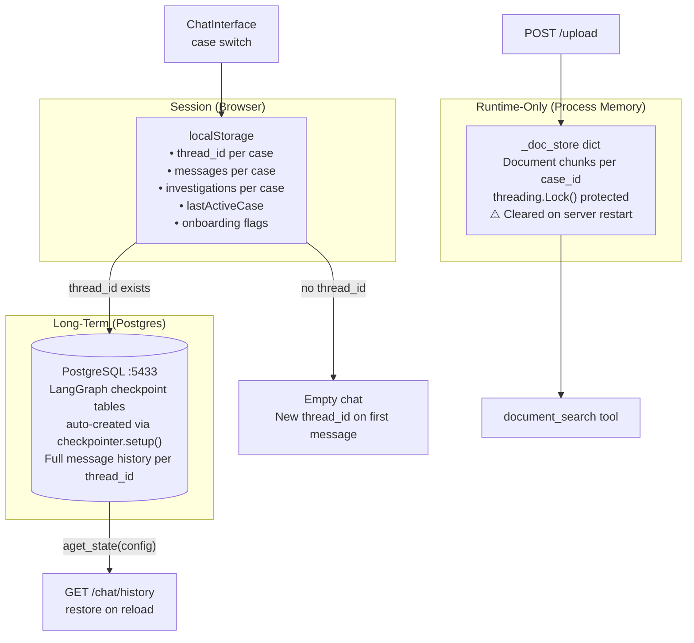

# 🔍 BakerStreet221B.ai — Sherlock ReAct Detective Agent

> *"Elementary, my dear Watson — Multimodal AI Mystery Solver"*

A full-stack **agentic AI** application built around a **LangGraph ReAct agent** powered by **Google Gemini 2.5 Flash**. Upload documents, interrogate evidence, search the web in real time, and watch the world's greatest consulting detective reason through your case — tool call by tool call, token by token.

[](https://python.org)
[](https://fastapi.tiangolo.com)
[](https://nextjs.org)
[](https://langchain-ai.github.io/langgraph/)
[](https://ai.google.dev)
[](https://www.postgresql.org)

---

## 🎯 What This Project Does

BakerStreet221B.ai demonstrates **agentic AI reasoning in action** — showing how an LLM, combined with a graph-based orchestration layer, can autonomously:

1. **Think** about the user's question using structured system prompt context
2. **Decide** which tool(s) to call next based on what it needs
3. **Observe** each tool's output and reason about it
4. **Repeat** until it reaches a confident, evidence-backed conclusion
5. **Stream** its reasoning transparently to the user via Server-Sent Events

Unlike a simple chatbot, this agent is *not* just answering from training data. It actively searches the web, runs math computations, and retrieves uploaded case files — all orchestrated transparently so you can watch every tool invocation in real time.

---

## 🗺️ System Architecture



---

## 🔄 ReAct Agent Flow

The core of this app is a **ReAct (Reason + Act)** loop — the LLM doesn't just answer, it thinks, picks a tool, observes the result, and thinks again.



---

## 📡 Real-Time Streaming & Tool Visibility

Users always see exactly what the agent is doing. The SSE stream emits typed events:



---

## 🧩 Component Reference

### Frontend Components

| Component | File | Responsibility |
|---|---|---|
| `page.tsx` | `src/app/page.tsx` | Root state orchestrator: activeCase, investigations, pendingMessage, suspects, entities, mobileTab, onboarding flags |
| `Header` | `components/Header.tsx` | Logo, title, subtitle, 🟢 Agent Active indicator |
| `ChatInterface` | `components/ChatInterface.tsx` | **Core engine**: SSE reader, typewriter queue, voice input (Web Speech API), TTS (SpeechSynthesis), file upload, NER extraction, SSE→JSON fallback |
| `CaseSidebar` | `components/ui/CaseSidebar.tsx` | Case list with localStorage persistence, + New Case button, date-stamped entries |
| `EvidencePanel` | `components/ui/EvidencePanel.tsx` | Suspects tab (name · risk badge · auto-detected flag) + Entities tab (name · type · notes) |
| `WelcomeModal` | `components/WelcomeModal.tsx` | First-visit onboarding modal |
| `OnboardingSteps` | `components/OnboardingSteps.tsx` | 3-step progress indicator: Case created → Evidence uploaded → First chat |
| `InvestigationPills` | `page.tsx` (inline) | Clickable question buttons generated by Sherlock on document upload |

### Backend Modules

| Module | File | Purpose |
|---|---|---|
| App Bootstrap | `app/main.py` | FastAPI app, `lifespan()` (DB pool + checkpointer setup), CORS middleware, route mounting |
| Chat API | `app/api/chat.py` | `POST /chat` (JSON fallback), `POST /chat/stream` (SSE), `GET /chat/history/{thread_id}` |
| Upload API | `app/api/upload.py` | Validate, parse PDF/TXT/DOCX via tempfile, chunk (1500 chars / 150 overlap), store in `_doc_store`, generate 5 investigation questions |
| Agent Factory | `app/agent/graph.py` | Gemini 2.5 Flash init, `AsyncPostgresSaver` pool, `get_agent_graph()` / `get_case_agent_graph(case_id)` factories |
| Tools | `app/agent/tools.py` | `web_search`, `calculator`, `make_document_search_tool(case_id)` factory, in-memory `_doc_store` with threading lock |
| System Prompt | `app/agent/prompts.py` | `SHERLOCK_SYSTEM_PROMPT` — enforces persona, tool rules, ReAct loop instructions |
| Investigations | `app/agent/investigations.py` | Standalone question-generation logic with filtering heuristics |
| Cases API | `app/api/cases.py` | SQLAlchemy-based `POST /cases/new`, `GET /cases/`, `DELETE /cases/{id}` (reserved for future use) |

---

## 🛠️ Full Tech Stack

| Layer | Technology | Version | Why |
|---|---|---|---|
| **Frontend Framework** | Next.js (App Router, Turbopack) | 16.2.9 | SSR, file-based routing, optimal streaming support |
| **Language** | TypeScript (strict mode) | 5.x | Type safety across all components and API shapes |
| **Styling** | Tailwind CSS v4 + shadcn/ui | 4.x | Utility-first, dark Victorian theme, glassmorphism |
| **Animation** | Framer Motion | 12.x | Micro-animations, enter/exit transitions |
| **Icons** | Lucide React | 0.562 | Consistent icon set (Brain, Wrench, Shield, etc.) |
| **Markdown** | react-markdown | 10.x | Render Sherlock's structured responses |
| **Voice Input** | Web Speech API | Native | `SpeechRecognition` with interim results (Chrome/Edge) |
| **TTS** | Web Speech Synthesis API | Native | British male voice, 0.88 rate, 0.82 pitch |
| **Backend Framework** | FastAPI | 0.127.0 | Async-native, Pydantic v2, auto OpenAPI docs |
| **Server** | Uvicorn | 0.40.0 | ASGI, supports `--reload` for dev |
| **Orchestration** | LangGraph | 1.0.5 | ReAct agent graph, `create_react_agent`, `astream_events` |
| **LLM** | Google Gemini 2.5 Flash | via langchain-google-genai | 1M token/day free tier, native streaming, strong tool-use |
| **Persistence** | LangGraph Postgres Checkpointer | 3.0.2 | Thread-isolated conversation memory across restarts |
| **DB Driver** | psycopg3 + psycopg-pool | 3.3.x | Async connection pool for checkpointer |
| **Web Search** | duckduckgo-search (DDGS) | 8.1.1 | No API key, returns structured results |
| **Math Engine** | numexpr + Python math | 2.14.1 | Safe expression evaluation, AST-restricted |
| **PDF Parsing** | PyPDFLoader (pypdf) | 6.13.3 | Multi-page PDF text extraction |
| **Text Splitting** | RecursiveCharacterTextSplitter | LangChain 1.2 | 1500-char chunks, 150-char overlap |
| **Database** | PostgreSQL + pgvector | via Docker | Checkpointer storage, future vector search |
| **Containerisation** | Docker Compose | 3.8 | DB + backend + frontend as services |

---

## 📁 Project Structure

```
bakerStreet221B.ai/
├── docker-compose.yml              # PostgreSQL (pgvector) + backend + frontend
├── backend/
│   ├── .env                        # DATABASE_URL · GOOGLE_API_KEY
│   ├── requirements.txt            # All pinned Python dependencies
│   ├── Dockerfile                  # Backend container
│   └── app/
│       ├── main.py                 # FastAPI app · lifespan · CORS · routes
│       ├── database.py             # SQLAlchemy engine + SessionLocal
│       ├── models/
│       │   ├── case.py             # Case ORM model
│       │   └── message.py          # Message ORM model
│       ├── agent/
│       │   ├── __init__.py         # Re-exports graph factories
│       │   ├── graph.py            # LLM init · Postgres pool · agent factories
│       │   ├── tools.py            # web_search · calculator · document_search factory
│       │   ├── prompts.py          # Sherlock system prompt (SystemMessage)
│       │   ├── state.py            # AgentState type alias
│       │   ├── investigations.py   # standalone question generation logic
│       │   └── nodes.py            # LLM ref + normalize_to_string helper
│       └── api/
│           ├── chat.py             # /chat · /chat/stream · /chat/history
│           ├── upload.py           # /upload — ingest + question generation
│           ├── cases.py            # /cases CRUD (SQLAlchemy)
│           └── messages.py         # /messages endpoint (reserved)
└── frontend/
    ├── Dockerfile                  # Frontend container
    ├── package.json                # Next.js + shadcn/ui + Framer Motion deps
    ├── components.json             # shadcn/ui config
    └── src/
        ├── app/
        │   ├── page.tsx            # Root page · state orchestrator
        │   ├── layout.tsx          # HTML shell · Google Fonts
        │   └── globals.css         # Tailwind base + custom animations
        └── components/
            ├── Header.tsx              # Top bar · logo · agent status dot
            ├── ChatInterface.tsx       # Chat · SSE · typewriter · voice · upload · NER · TTS
            ├── WelcomeModal.tsx        # First-visit modal
            ├── OnboardingSteps.tsx     # 3-step progress tracker
            ├── CaseBoard.tsx           # Legacy board (clue/suspect display)
            └── ui/
                ├── CaseSidebar.tsx     # Case list · create · localStorage
                └── EvidencePanel.tsx   # Suspects · Entities tracker
```

---

## 📄 Document Ingestion Pipeline



---

## 💾 Memory & Persistence Architecture



---

## 🎨 UI Features

| Feature | Implementation |
|---|---|
| **Dark Victorian Theme** | Amber/slate palette, glassmorphism (`bg-slate-900/80`), subtle noise texture via SVG |
| **Typewriter Effect** | `setInterval` at 18ms, 2 chars/tick, queue-based to avoid re-render storms |
| **Tool Badge** | `on_tool_start` → amber pulsing `animate-pulse`; `on_tool_end` → green `✓` |
| **Thinking Dots** | `animate-bounce` with staggered `animation-delay` on three `●` spans |
| **Voice Input** | `SpeechRecognition` with `interimResults: true`; fills input box |
| **TTS** | `SpeechSynthesisUtterance` with en-GB language, British male voice preference, Markdown stripped |
| **Client-Side NER** | Regex heuristics: title-prefix names, consecutive capitalised words, known locations, date patterns |
| **Responsive Layout** | Desktop: 3-column (sidebar · chat · evidence); Mobile: bottom tab bar with `FolderOpen · MessageSquare · Shield` |
| **Onboarding** | `WelcomeModal` on first visit + 3-step `OnboardingSteps` tracker per case |
| **Markdown Rendering** | `react-markdown` with custom Tailwind prose components for all block elements |
| **SSE → JSON Fallback** | If streaming `fetch` fails, silently retries `POST /chat` (standard JSON) |

---

## ⚠️ Real Problems Encountered & How They Were Solved

These are the actual bugs and engineering challenges faced during development:

| # | Problem | Root Cause | Solution |
|---|---------|-----------|----------|
| 1 | **Postgres connection refused on startup** | `uvicorn` tried to open DB pool before Docker container was healthy | `docker compose up -d db` first; `connection_pool.open()` inside `lifespan()` startup hook |
| 2 | **SSE stream not reaching browser** | Default HTTP buffering swallowed partial chunks before `\n\n` boundaries | Set `Cache-Control: no-cache` and `X-Accel-Buffering: no` on `StreamingResponse` headers |
| 3 | **Case isolation broken** | `document_search` used a module-level `_doc_store` without case scoping | Created `make_document_search_tool(case_id)` factory — `case_id` is captured in a closure, never passed by the LLM |
| 4 | **Chat history lost on page refresh** | No persistence layer initially; all state was in React memory | `localStorage` saves messages per case; `GET /chat/history/{thread_id}` fetches from Postgres checkpoint |
| 5 | **Tool name not visible to user** | SSE events were emitted but the UI had no indicator | `on_tool_start` → amber pulsing Wrench badge with tool name; `on_tool_end` → green ✓ badge; cleared on `done` |
| 6 | **Typewriter effect caused re-render storms** | Calling `setMessages()` per token (potentially hundreds per second) triggered constant React re-renders | Queue-based typewriter: tokens buffered in a `useRef` array, drained 2 chars/tick on an 18ms `setInterval` — single `setState` per interval tick |
| 7 | **document_search returning nothing after upload** | `case_id` wasn't passed when no active case was selected in the UI | Fallback chain in `store_document_chunks`: `case_id → thread_id → "default"` |
| 8 | **Port 5433 vs 5432 confusion** | Docker maps host:5433 → container:5432; local Homebrew Postgres uses 5432 | `.env` `DATABASE_URL` uses port 5433 (Docker host port); `docker-compose.yml` maps `5433:5432` correctly |
| 9 | **LLM breaking Sherlock character** | No explicit persona enforcement in early prompts | System prompt hardcodes persona rules: `"Respond in the voice of Sherlock Holmes"` and `"Never break character"` as explicit constraints |
| 10 | **Multiple dev servers on same port** | Next.js auto-bumps to 3001 when 3000 is taken; backend CORS only allowed 3000 | Added `http://localhost:3001` to CORS `allow_origins` list in `main.py` |
| 11 | **Graph creates new instance per request** | `get_case_agent_graph(case_id)` was called per request, creating new graph instances | Checkpointer is shared (singleton pool), so memory is preserved; graph creation is lightweight (no state) |
| 12 | **LangGraph `astream_events` v1 vs v2** | `version="v1"` event names differed from v2; `on_tool_start`/`on_tool_end` not firing | Pinned to `version="v2"` in the `astream_events()` call — only version with consistent tool event names |
| 13 | **Voice input not working on mobile** | `SpeechRecognition` is non-standard; not available in Safari or Firefox | Gracefully hides mic button if `window.SpeechRecognition` and `window.webkitSpeechRecognition` are both undefined |
| 14 | **NER polluting Evidence Panel with false positives** | Generic capitalised words being flagged as suspects | Added a blocklist (`"The Game"`, `"The Web"`, `"Let Me"`) + minimum name length check + location deduplication against suspects |
| 15 | **TTS saying Markdown symbols aloud** | `SpeechSynthesisUtterance` doesn't strip `**`, `#`, `_` | `stripMarkdown()` helper regex-strips all Markdown before passing text to the utterance |

---

## ✨ Features Checklist

- [x] 🧠 **ReAct Agent** — Multi-step Reason → Act → Observe loop via LangGraph `create_react_agent`
- [x] 💬 **Real-time Streaming** — Server-Sent Events with `astream_events(version="v2")`
- [x] ⌨️ **Typewriter Effect** — Queue-based, 2 chars/tick at 18ms interval
- [x] 🔧 **Tool Visibility** — Amber pulsing badge → green ✓ badge per tool call
- [x] 🔍 **Web Search** — DuckDuckGo DDGS, 5 results, no API key needed
- [x] 🧮 **Calculator** — `numexpr` + `math` module fallback, regex-sanitised input
- [x] 📄 **Document Search** — Upload PDF/TXT/DOCX, keyword-scored chunk retrieval, case-scoped
- [x] 📁 **Case Isolation** — Per-case doc store, thread_id, localStorage, investigations
- [x] 🎙️ **Voice Input** — Web Speech API, interim results, Chrome/Edge
- [x] 🔊 **Text-to-Speech** — SpeechSynthesis with British male voice, Markdown stripped
- [x] 💾 **Persistent Memory** — LangGraph `AsyncPostgresSaver` + `localStorage` cache
- [x] 💡 **Investigation Pills** — Sherlock auto-generates 5 questions per document upload
- [x] 🕵️ **Client NER** — Regex-based Named Entity Recognition populates Evidence Panel
- [x] 🎭 **Sherlock Persona** — Character-enforced system prompt, in-character reasoning
- [x] 📱 **Responsive UI** — 3-column desktop / bottom-tab mobile
- [x] 🎨 **Victorian Dark Theme** — Amber/slate palette, glassmorphism, micro-animations
- [x] 🔄 **SSE → JSON Fallback** — Graceful degradation if streaming unavailable
- [x] 🎉 **Onboarding** — WelcomeModal + 3-step progress tracker per case

---

## 🚦 Quick Start

### Prerequisites

- Docker Desktop (for PostgreSQL)
- Node.js 20+
- Python 3.13
- [Google AI Studio API Key](https://aistudio.google.com/apikey) (free)

### 1. Clone & Configure

```bash
git clone <repo-url>
cd bakerStreet221B.ai

# Add your API key to backend/.env
echo "GOOGLE_API_KEY=your_key_here" >> backend/.env
```

### 2. Start the Database

```bash
docker compose up -d db
# PostgreSQL available at localhost:5433
# (mapped from container port 5432)
```

### 3. Start the Backend

```bash
cd backend
python -m venv venv
source venv/bin/activate       # Windows: venv\Scripts\activate
pip install -r requirements.txt
uvicorn app.main:app --reload
# API at http://localhost:8000
# Auto-docs at http://localhost:8000/docs
```

### 4. Start the Frontend

```bash
cd frontend
npm install
npm run dev
# App at http://localhost:3000
```

### 5. Full Docker (all services)

```bash
# Add GOOGLE_API_KEY to backend/.env first
docker compose up --build
# App at http://localhost:3000
```

### 6. Start Investigating

1. Open `http://localhost:3000`
2. Click **+ New Case** in the sidebar
3. Upload a PDF, TXT, or DOCX as evidence
4. Watch Sherlock analyse it and generate 5 investigation questions
5. Click an Investigation Pill or ask your own question
6. Watch the **amber tool badge** to see which tool Sherlock is using in real time

---

## 🎙️ Interview Questions & Answers

> *Everything a technical interviewer would ask about this project — and the honest answers.*

---

### 🧠 Architecture & Design

**Q: What is the ReAct pattern and how does it work in this project?**

ReAct = **Re**asoning + **Act**ing. Instead of a single LLM call, the agent loops: it reasons about the question, decides if it needs a tool, calls the tool, observes the output, reasons again, and repeats until it has enough evidence to answer. In this project, LangGraph's `create_react_agent` implements this loop by managing the `AgentState` (a list of messages) and routing between the LLM and tools. The loop terminates when the LLM produces a final `AIMessage` without any tool calls.

**Q: Why LangGraph over a simple function-calling loop?**

LangGraph provides built-in: (1) **checkpointing** — each graph step is saved to Postgres, so conversations survive server restarts; (2) **thread isolation** — `thread_id` in config scopes all checkpoint reads/writes; (3) **streaming** — `astream_events()` emits granular events (`on_chat_model_stream`, `on_tool_start`, `on_tool_end`) that we surface to the user. A hand-rolled loop would require rebuilding all of this.

**Q: How does case isolation work for document search?**

The `_doc_store` is a module-level Python `dict` keyed by `case_id`. When a document is uploaded, `store_document_chunks(case_id, chunks)` is called (under a `threading.Lock()`). When the agent needs to search documents, it uses `make_document_search_tool(case_id)` — a factory that returns a `@tool`-decorated function with `case_id` captured in its closure. This means the LLM **never has to pass** `case_id` as a parameter, eliminating an entire class of routing bugs.

**Q: What are the tradeoffs of your in-memory document store?**

**Pro**: Zero latency, no vector DB setup, no embedding model needed.  
**Con**: Documents are lost on server restart. Not horizontally scalable (two server instances have separate stores). No semantic search — only keyword frequency scoring.  
**Future fix**: Replace with a proper vector store (pgvector already installed) using embedding-based similarity search for much better retrieval.

**Q: How does the SSE streaming pipeline work end-to-end?**

1. Frontend sends `POST /chat/stream` with JSON body
2. FastAPI returns a `StreamingResponse` with `text/event-stream` content type
3. Backend calls `graph.astream_events(messages, config, version="v2")` — an async generator
4. For each event yielded, we serialize it as `data: {JSON}\n\n` and yield from the generator
5. Frontend uses `fetch` + `ReadableStream` + `TextDecoder` to read the stream line-by-line
6. Lines matching `data: ` are JSON-parsed and dispatched by type: `token`, `tool`, `tool_result`, `done`, `error`

**Q: Why do you use a typewriter queue instead of updating state per token?**

Gemini streams tokens at high speed. If we called `setMessages()` on every token, React would re-render the entire message list potentially 50-100 times per second, causing visible jank. The queue approach: tokens are pushed into a `useRef` array (no React state), and a single `setInterval` at 18ms drains 2 characters at a time, making one `setState` call per tick regardless of token rate.

---

### 🔧 Technical Deep Dives

**Q: How does your calculator tool prevent code injection?**

Two layers: (1) regex `re.sub(r"[^0-9+\-*/().,\s%^a-zA-Z_]", "", expression)` strips any character not valid in a math expression before evaluation; (2) the `eval()` fallback uses `{"__builtins__": {}}` as globals — completely removes access to Python builtins like `__import__`, `open`, `exec`, etc. Only an allowlist of `math` module functions is available.

**Q: Walk me through what happens when a user uploads a PDF.**

1. `POST /upload` receives `UploadFile` + `case_id` + `thread_id` as form data
2. File extension is validated against `{.pdf, .txt, .docx}` and MIME type
3. File bytes are written to a `tempfile.NamedTemporaryFile` (automatically deleted in `finally`)
4. `PyPDFLoader` (for PDF) or `TextLoader` (for TXT/DOCX) extracts raw text
5. `RecursiveCharacterTextSplitter` chunks it (1500 chars, 150 overlap)
6. Chunks stored in `_doc_store[case_id]` under a lock
7. First 4000 chars sent to Sherlock agent: `ainvoke` generates 5 investigation questions
8. Questions parsed from response (lines containing `?`, fallback to any non-empty lines)
9. Response JSON: `{filename, chunks, investigations, thread_id}`
10. Frontend renders success message + populates InvestigationPills + saves to localStorage

**Q: How does LangGraph Postgres checkpointing work?**

`AsyncPostgresSaver` creates tables (`checkpoints`, `checkpoint_writes`, etc.) in Postgres on `checkpointer.setup()`. Every time the agent graph runs, it reads the latest checkpoint for the given `thread_id`, appends new messages, and writes the updated state back. This means: if the server restarts, the next request with the same `thread_id` picks up exactly where the conversation left off — the LLM sees full history automatically.

**Q: Why does `get_case_agent_graph()` create a new graph instance per request instead of caching?**

Because the `document_search` tool is case-specific — it contains a different `case_id` in its closure for each case. Caching would require a `dict` keyed by `case_id`, which is valid but adds complexity. Creating a new LangGraph agent instance is cheap (it's just wiring together references — no model loading). The shared `checkpointer` ensures memory continuity.

**Q: How does the `X-Thread-Id` header work?**

The backend generates a `uuid4()` if no `thread_id` is sent. It's returned in the `X-Thread-Id` response header *before* the SSE body starts streaming. The frontend reads `res.headers.get("X-Thread-Id")` immediately after the `fetch`, stores it in `localStorage` under `thread_${activeCase}`, and includes it in all subsequent requests for that case. This ties the LangGraph checkpoint to the browser session.

---

### 🏗️ System Design

**Q: How would you scale this to production?**

1. **Document storage**: Replace in-memory `_doc_store` with pgvector embeddings. Use `text-embedding-004` to embed chunks, store in Postgres, use cosine similarity search instead of keyword scoring.
2. **Horizontal scaling**: Move `_doc_store` out of process memory into Redis or the DB. Use a load balancer.
3. **Auth**: Add user authentication (JWT/session), scope cases to user IDs.
4. **Rate limiting**: Add FastAPI middleware for per-user request limits against the Gemini API.
5. **File persistence**: Store uploaded files in Google Cloud Storage or S3 instead of tempfiles.
6. **Observability**: Add LangSmith tracing (already supported by LangChain) for agent step monitoring.

**Q: What are the limitations of keyword-based document search vs vector search?**

Keyword search (TF-IDF-style word counting) fails on synonyms, paraphrasing, and semantic similarity. E.g., querying "financial records" won't match a chunk containing "accounting ledger". Vector search converts both query and chunks to embeddings, then finds nearest neighbors in embedding space — it understands semantics. pgvector is already in the stack; the migration would require an embedding model call per chunk at upload time.

**Q: How does the multi-tool reasoning work in practice?**

Gemini 2.5 Flash natively supports parallel and sequential tool calls. The system prompt instructs: *"If a document question needs web context to cross-reference, use both document_search AND web_search."* In practice: the LLM may call `document_search` first, observe excerpts, then call `web_search` to verify a fact from those excerpts, then synthesize both results into a final answer. LangGraph manages this as multiple `ToolMessage` entries in the message list.

---

### 🎯 Impact & Outcomes

**Q: What makes this project different from a simple chatbot wrapper?**

1. **Transparent reasoning**: Users see every tool call in real time — not a black box
2. **Ground-truth answers**: Tools provide external evidence, not hallucinated facts
3. **Persistent memory**: Conversations survive across sessions via Postgres
4. **Multi-source synthesis**: The agent can combine web search + document content + math in a single answer chain
5. **Case management**: Isolated investigative contexts — each case has its own memory, document store, and question set

**Q: What did you learn from building this?**

- **Async Python matters**: `psycopg3` async + FastAPI's `async def` + LangGraph's `astream_events` must all be consistently async to avoid blocking the event loop
- **SSE is harder than it looks**: Browser buffering, nginx buffering, and proper `\n\n` framing all have to be right simultaneously
- **LLM prompt engineering is critical**: Without the explicit `"Never break character"` and tool usage rules, the agent would ignore tools or answer generically
- **State management at the frontend is non-trivial**: The typewriter + SSE reader + file upload + pending message from pills all share the same `activeCase` and `threadId` state, requiring careful `useCallback` dependency arrays and `AbortController` cleanup

---

## 🚀 What's Next

- [ ] **pgvector semantic search** — Replace keyword scoring with embedding-based similarity
- [ ] **Multi-file upload** — Upload multiple documents to the same case
- [ ] **Suspect relationship graph** — Visual D3.js graph of entity connections
- [ ] **Case export** — Export full investigation as PDF or markdown
- [ ] **User authentication** — Multi-user support with scoped cases
- [ ] **LangSmith tracing** — Production observability for agent steps
- [ ] **Streaming upload progress** — Real-time chunk count during PDF ingestion

---

## 📜 License

MIT — *"The game is afoot."*

---

> Built with 🔍 by Raj Aryan · Powered by Google Gemini 2.5 Flash · LangGraph · FastAPI · Next.js 16