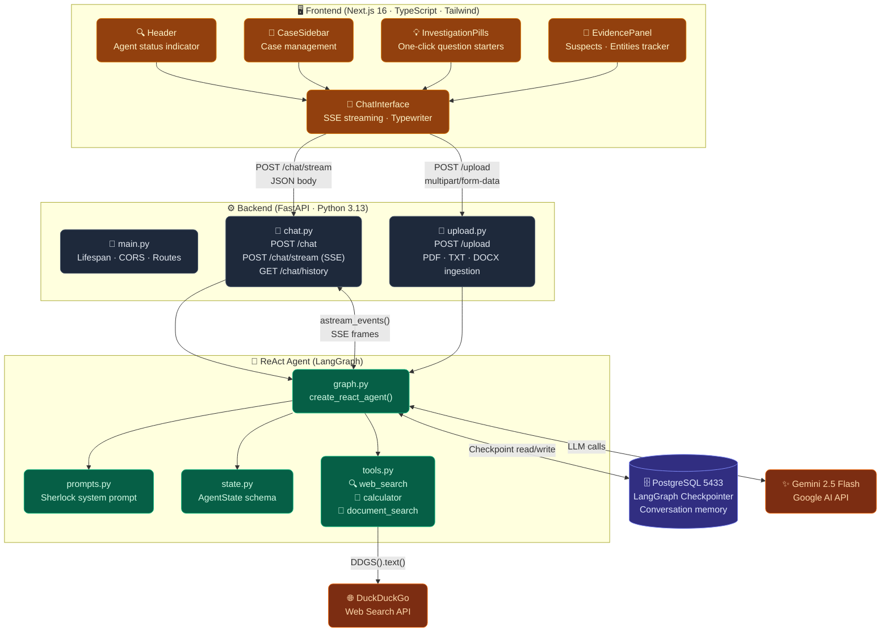
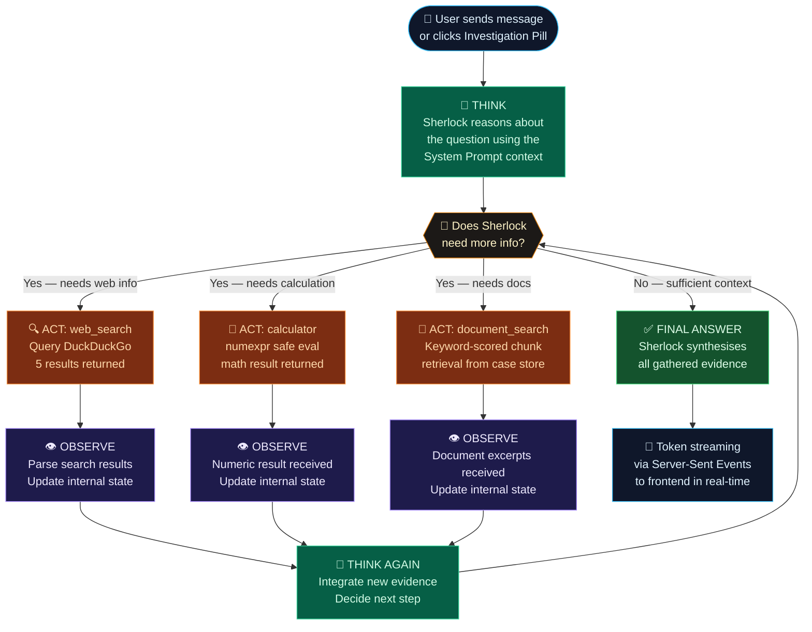
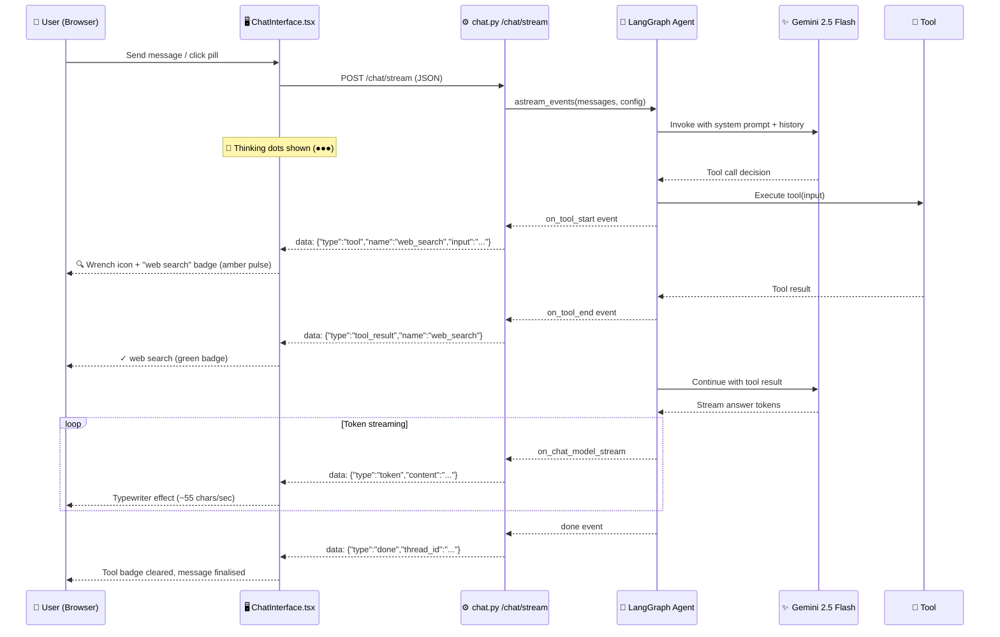
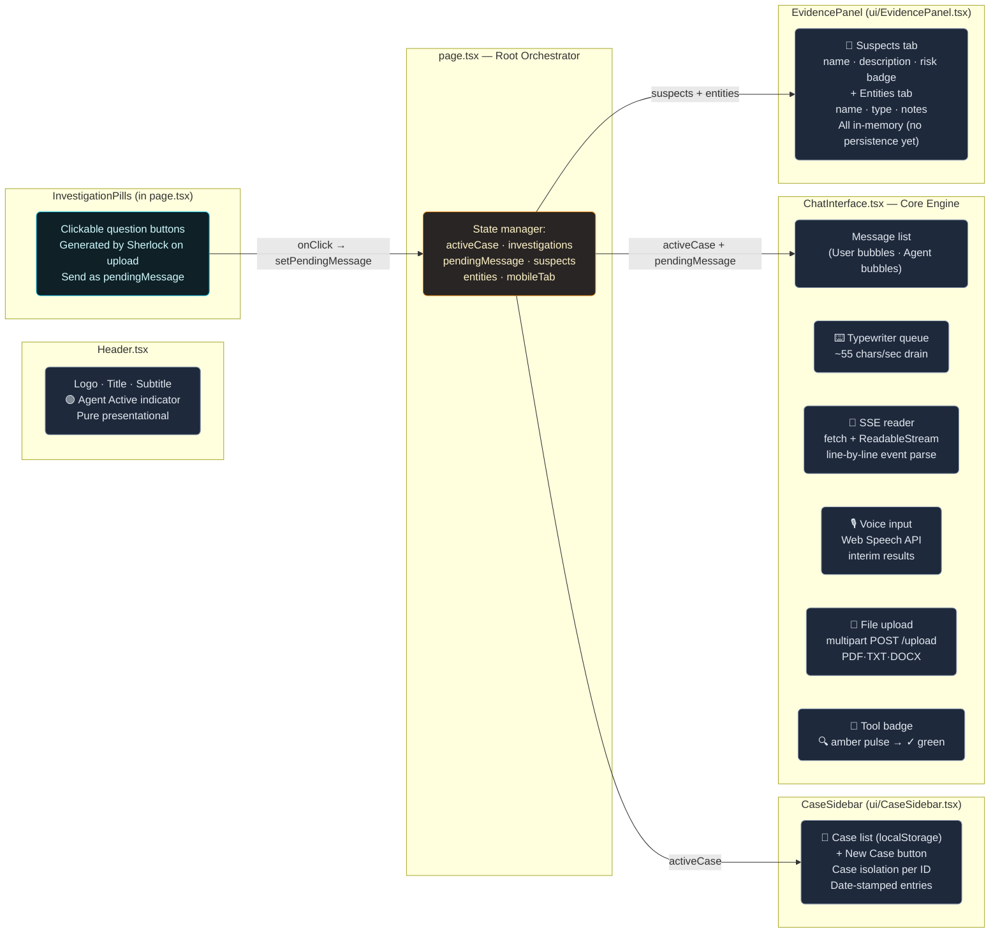
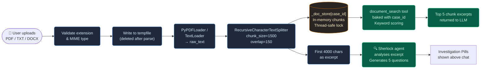
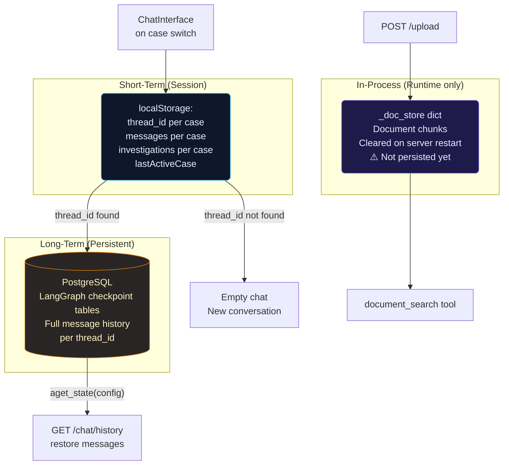
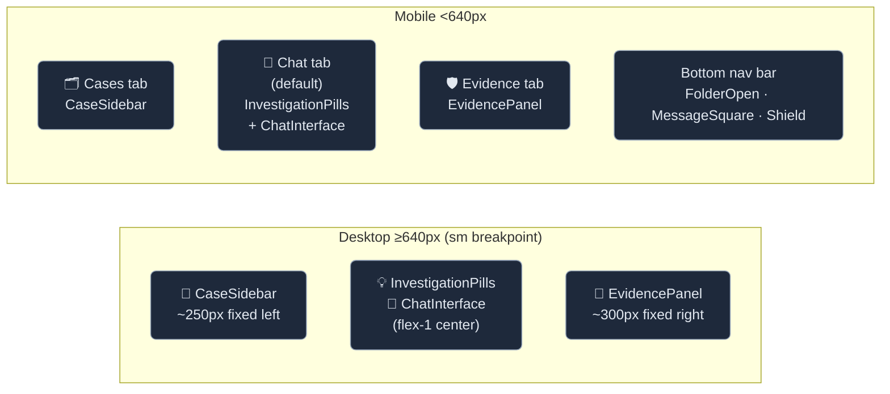

# 🔍 BakerStreet221B.ai — Sherlock ReAct Detective Agent

> *"Elementary, my dear Watson — Multimodal AI Mystery Solver"*

A full-stack AI detective application powered by a **LangGraph ReAct agent** running **Google Gemini 2.5 Flash**, wrapped in a cinematic Sherlock Holmes–themed UI. Upload documents, interrogate evidence, search the web, and let the world's greatest consulting detective reason through your case — step by step, tool by tool.

---

## 🎯 Purpose of this Project

BakerStreet221B.ai was built to demonstrate **agentic AI reasoning in action** — showing how a Large Language Model, combined with a graph-based orchestration layer, can autonomously:

1. **Decide** which tool to call next based on context
2. **Observe** the tool's result
3. **Reason** about what it learned
4. **Repeat** until it reaches a confident conclusion

Unlike a simple chatbot, this agent is *not* just answering from training data. It actively searches the web, runs calculations, and searches through uploaded case files — all orchestrated transparently so the user can watch every tool invocation in real time.

---

## 🗺️ System Architecture Overview



---

## 🔄 ReAct Agent Flow (Reasoning + Acting)

The core of BakerStreet221B.ai is a **ReAct (Reason + Act)** loop. The LLM doesn't just answer — it thinks, picks a tool, observes the result, and thinks again. Here's how it works:



---

## 📡 Real-Time Streaming & Tool Visibility

The user always knows exactly what the agent is doing. The SSE stream emits typed events:



---

## 🧩 Component Reference — Every Part Explained

### Frontend Components



---

### Backend Modules

| Module | Purpose | Key Functions / Components |
|---|---|---|
| `main.py` | App Bootstrap | • `lifespan()`: DB pool & checkpointer setup<br>• CORS Middleware<br>• Route mounting |
| `chat.py` | Chat API | • `POST /chat`: JSON fallback<br>• `POST /chat/stream`: SSE streaming<br>• `GET /chat/history/{id}`: Postgres message restore |
| `upload.py` | Document Ingestion | • `POST /upload`: Validates, parses, chunks text (1500 chars), stores in `_doc_store`, and asks Sherlock for 5 initial questions |
| `graph.py` | Agent Factory | • Gemini 2.5 Flash LLM init<br>• `AsyncPostgresSaver` checkpointer<br>• `get_agent_graph()` / `get_case_agent_graph()` factories |
| `tools.py` | Agent Tools | • `web_search()`: DuckDuckGo API<br>• `calculator()`: numexpr safe math<br>• `make_document_search_tool()`: Keyword scoring retrieval over `_doc_store` |
| `prompts.py` | System Prompt | • `SHERLOCK_SYSTEM_PROMPT`: Enforces persona, tool rules, and ReAct loop |

---

## 🛠️ Tech Stack

| Category | Technologies |
|---|---|
| **🖥️ Frontend** | • **Framework:** Next.js 16 (App Router, Turbopack)<br>• **Language:** TypeScript (Strict mode)<br>• **Styling:** Tailwind CSS v4, shadcn/ui, Lucide React<br>• **Features:** react-markdown, Web Speech API (Voice input) |
| **⚙️ Backend** | • **Framework:** FastAPI 0.127 (Async, Pydantic v2), Uvicorn<br>• **Orchestration:** LangChain 1.2, LangGraph 1.0<br>• **Database Driver:** psycopg3 + connection pool<br>• **Utilities:** PyPDF, TextLoader, duckduckgo-search, numexpr |
| **🧠 AI** | • **Model:** Google Gemini 2.5 Flash (via `langchain-google-genai`)<br>• **Architecture:** ReAct Agent Pattern (`create_react_agent`)<br>• **Memory:** LangGraph Postgres Checkpointer (thread isolation) |
| **🏗️ Infrastructure**| • **Database:** PostgreSQL (with `pgvector` extension) running in Docker<br>• **Deployment:** Docker Compose, `.env` config management |

---

## 🗄️ Data Flow: Document Upload & Case Isolation



---

## 💾 Memory & Persistence Architecture



---

## 📱 Responsive Layout



---

## ⚠️ Problems Faced During Development

| # | Problem | Root Cause | Solution Applied |
|---|---------|-----------|-----------------|
| 1 | **Postgres connection refused on startup** | Docker DB container not running before `uvicorn` | `docker compose up -d db` first; `connection_pool.open()` in lifespan |
| 2 | **SSE streaming not working** | `Cache-Control` not disabled; Nginx buffering | Added `X-Accel-Buffering: no` header; set `Cache-Control: no-cache` |
| 3 | **Case isolation broken** | `document_search` used a global store without scoping | `make_document_search_tool(case_id)` factory — bakes case_id into closure |
| 4 | **Chat history lost on refresh** | No persistence layer initially | `localStorage` for messages + thread_id; Postgres checkpoint for LangGraph state |
| 5 | **Tool name not visible to user** | SSE events emitted but UI had no indicator | `on_tool_start` → amber pulsing wrench badge; `on_tool_end` → green ✓ badge |
| 6 | **Multiple Next.js dev servers conflict** | Port 3000 already occupied | Port auto-bumps to 3001; or `kill <PID>` to free 3000 |
| 7 | **LLM breaking character** | No explicit persona enforcement | System prompt hardcodes Sherlock persona with *"Never break character"* rule |
| 8 | **Typewriter effect janky** | Updating React state per token caused re-render storms | Queue-based typewriter: chars buffered, drained 2/tick on 18ms `setInterval` |
| 9 | **document_search returning nothing** | `case_id` not passed on upload without active case | Fallback chain: `case_id → thread_id → "default"` in `store_document_chunks` |
| 10 | **Port 5433 vs 5432 confusion** | Docker maps 5433→5432; local brew Postgres uses 5432 | `.env` uses 5433 (Docker host port); `docker-compose.yml` maps correctly |

---

## ✨ Current Features

- 🧠 **ReAct Agent** — Multi-step Reason → Act → Observe loop via LangGraph
- 💬 **Real-time Streaming** — Server-Sent Events, typewriter effect at ~55 chars/sec
- 🔧 **Tool Visibility** — Amber pulsing badge shows active tool; green badge on completion
- 🔍 **Web Search** — Live DuckDuckGo search, no API key required
- 🧮 **Calculator** — Safe `numexpr` math + Python `math` fallback
- 📄 **Document Search** — Upload PDF/TXT/DOCX; keyword-scored chunk retrieval per case
- 📁 **Case Isolation** — Each case has its own doc store, thread_id, and localStorage
- 🎙️ **Voice Input** — Web Speech API with interim results (Chrome/Edge)
- 💾 **Persistent Memory** — LangGraph PostgreSQL checkpointer; session survives restarts
- 💡 **Investigation Pills** — Sherlock auto-generates 5 clickable questions per upload
- 🎭 **Sherlock Persona** — Fully in-character responses, deduction-style reasoning
- 📱 **Responsive UI** — Desktop 3-column layout; mobile bottom-tab navigation
- 🎨 **Dark Victorian Theme** — Amber/slate palette, glassmorphism, micro-animations
- 🔄 **SSE → JSON Fallback** — Gracefully degrades if streaming unavailable

---


## 🚦 Quick Start

### Prerequisites

- Docker Desktop (for PostgreSQL)
- Node.js 20+
- Python 3.13
- A [Google AI Studio API Key](https://aistudio.google.com/apikey)

### 1. Clone & Configure

```bash
git clone <repo-url>
cd bakerStreet221B.ai

# Set your API key
echo "GOOGLE_API_KEY=your_key_here" >> backend/.env
```

### 2. Start the Database

```bash
docker compose up -d db
# Postgres starts on localhost:5433
```

### 3. Start the Backend

```bash
cd backend
python -m venv venv
source venv/bin/activate
pip install -r requirements.txt
uvicorn app.main:app --reload
# API available at http://localhost:8000
```

### 4. Start the Frontend

```bash
cd frontend
npm install
npm run dev
# App available at http://localhost:3000
```

### 5. Start Investigating

1. Click **+ New Case** in the sidebar
2. Upload a PDF, TXT, or DOCX as evidence
3. Watch Sherlock generate 5 investigation questions
4. Click a pill or ask your own question
5. Watch the **tool badge** to see which tool Sherlock is using

---

## 📁 Project Structure

```
bakerStreet221B.ai/
├── docker-compose.yml          # PostgreSQL (pgvector) + services
├── backend/
│   ├── .env                    # DATABASE_URL · GOOGLE_API_KEY
│   ├── requirements.txt        # All Python dependencies
│   └── app/
│       ├── main.py             # FastAPI app · lifespan · CORS · routes
│       ├── database.py         # (reserved for future SQLAlchemy models)
│       ├── agent/
│       │   ├── graph.py        # LLM init · Postgres pool · agent factories
│       │   ├── tools.py        # web_search · calculator · document_search
│       │   ├── prompts.py      # Sherlock system prompt
│       │   ├── state.py        # AgentState type definition
│       │   └── nodes.py        # (reserved for custom nodes)
│       └── api/
│           ├── chat.py         # /chat · /chat/stream · /chat/history
│           └── upload.py       # /upload — ingest + question generation
└── frontend/
    ├── src/
    │   ├── app/
    │   │   └── page.tsx        # Root page · state orchestrator
    │   └── components/
    │       ├── Header.tsx          # Top bar · logo · agent status
    │       ├── ChatInterface.tsx   # Chat · SSE · typewriter · voice · upload
    │       ├── CaseBoard.tsx       # (legacy clue/suspect display)
    │       └── ui/
    │           ├── CaseSidebar.tsx # Case list · create · localStorage
    │           └── EvidencePanel.tsx # Suspects · Entities tracker
    └── .env.local              # NEXT_PUBLIC_BACKEND_URL
```

---

## 📜 License

MIT — *"The game is afoot."*

---

> Built with 🔍 by Raj Aryan · Powered by Google Gemini 2.5 Flash · LangGraph · FastAPI · Next.js